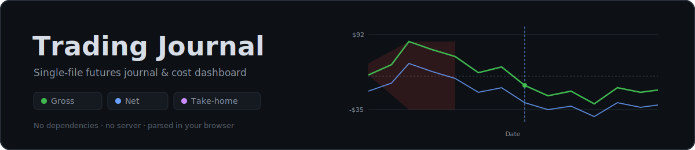

<p align="center">
  
</p>

<p align="center">
  
  
  
  
</p>

---

A **single-file, dependency-free** trading journal and cost dashboard for futures traders. It
reads a balance-history CSV exported from **TradingView**, parses it entirely in the browser,
and renders performance, calendar, cost, and statistics views. There is no server, no build
step, and no network call except an optional PayPal donate button — the whole app is one
`index.html` you can open from disk or host as a static page.

> **For maintainers / future context:** this README is intentionally complete. It documents
> not just how to use the app but how it is built — the data flow, the cost model, every
> editable data structure, the global state, and the runtime behaviors — so the codebase can
> be understood from this file alone.

## Table of contents

- [Quick start](#quick-start)
- [Input: the CSV](#input-the-csv)
- [UI walkthrough](#ui-walkthrough) — what every section does
- [Cost model](#cost-model) — commissions, subscriptions, tax
- [Editable data tables](#editable-data-tables) — brokers, fees, feeds, states
- [Architecture](#architecture) — how the code is organized
- [Runtime behaviors](#runtime-behaviors) — scope, persistence, gating, export, contact
- [Known limitations](#known-limitations)
- [Privacy](#privacy)
- [Development & preview](#development--preview)
- [License](#license)

## Quick start

1. Open `index.html` in any modern browser.
2. In the **Setup** element, choose your **Broker**, **Data feed**, and **State**, and set the
   monthly **Platform fee**. (The Load CSV button is disabled until broker, feed, and state are
   all chosen.)
3. In TradingView, export your account balance history as CSV.
4. Click **Load CSV** (at the bottom of the Setup element on the start page) and select the file.

Prefer to look around first? Click **Demo** to load a generated sample dataset using default
selections (AMP broker, CME bundle data feed, Arkansas tax, $35 platform fee).

## Input: the CSV

The parser expects a TradingView balance-history export. Required columns (matched
case-insensitively by substring): **`Time`**, **`Realized PnL (value)`** (falls back to
`Realized PnL`), and **`Action`**. The parser is quote-aware because the `Action` field
contains commas inside quotes.

Each CSV **row is treated as one trade** — a position-*close* event with its own realized PnL.
The instrument is parsed from the `Action` text, e.g. `... for symbol MESM2025 at price ...`,
and reduced to a **root ticker** (`MESM2025` → `MES`, `MES1!` → `MES`, `M2KZ2025` → `M2K`).

```
Time,Action,Realized PnL (value)
2026-06-02 10:00:00,"Close long position for symbol MESM2025 at price 5300.00",75.00
```

## UI walkthrough

The layout, top to bottom:

| Section | What it shows |
| --- | --- |
| **Top bar** | App title (click to reset), data summary, and the action buttons. |
| **Setup** | Broker / data feed / platform fee / state. Collapsible once data is loaded. |
| **Scope toggle** | Switches most views between *All time* and the *Selected month*. |
| **Stat cards** | Net PnL (+ after-tax take-home), win rate, profit factor, avg win/loss, max drawdown. |
| **Performance** | Cumulative PnL vs. date, with Gross/Net/Take-home overlays, hover, and a click-to-mark date. |
| **Trading Calendar** | Sunday-first month grid of daily PnL with weekly summaries. |
| **Break-even & Cost Budget** | Per-symbol commission table, subscription/tax waterfall, take-home, break-even per trade. |
| **Advanced Statistics** | Daily averages, best/worst trade, Sharpe, recovery factor, streaks, date span. |
| **Definitions & Caveats** | How each number is computed and where the data falls short. |

### Performance graph

Cumulative PnL plotted against the **calendar date**. The X axis (labeled *Date*) spans the
selected month's first-to-last day in *Selected month* scope, or the full sample's first-to-last
trade date in *All time*. The Y axis is labeled *Cumulative PnL ($)*. Three series can be toggled
as overlays:

- **Gross** (green) — cumulative realized PnL, with a shaded drawdown band from the running peak.
- **Net** (blue) — gross minus commissions minus subscriptions.
- **Take-home** (purple) — Net after the estimated Section 1256 tax.

Hovering shows a tooltip with each visible series' value at the nearest day; **clicking a day in
the calendar** drops a dashed marker on the graph at that date.

### Trading calendar

Sunday-first month grid. Each day cell is colored by result and shows PnL, trade count, and day
win-rate. The left column summarizes each week (PnL and active days). Month navigation is
independent of the scope toggle — the calendar always shows the navigated month. Clicking a day
highlights it on the Performance graph.

## Cost model

Costs are applied to whatever scope is active (all-time or the selected month).

### Commissions (per symbol, broker-aware)

For each trade the root ticker is priced as:

```
all-in per side = broker commission (micro|standard tier) + CME exchange/clearing/NFA fee
round-turn per trade = 2 × all-in per side          (one entry + one exit, 1 contract)
```

- The **broker commission** comes from the selected broker's schedule (`BROKERS`).
- The **exchange/clearing/NFA fee** comes from a shared per-root table (`EXCH`).
- A symbol's **tier** (micro vs. standard) is from `MICRO`/`EXCH`, falling back to a heuristic
  (`M`-prefixed roots are treated as micros).
- Symbols with no known exchange fee use a fallback and are flagged with `*` in the table.

The Break-even panel lists every traded symbol with trade count, per-side rate, round-turn rate,
and total commission. The profit-factor card is recomputed net of each trade's round-turn cost.

### Subscriptions (not prorated)

`platform fee + data-feed fee` is charged as a **full month for every distinct calendar month**
present in the active scope. One month of trades is charged one month; three months, three. It is
never prorated by day.

### Tax (Section 1256, estimated)

```
blended rate = 0.60 × 15% (long-term) + 0.40 × 24% (ordinary) + state top marginal rate
```

Applied to net pre-tax profit **only when positive**. The 15% and 24% assumptions are fixed
constants (`LTCG`, `FED_ORD`); the state rate comes from the `STATES` table. This is a rough
planning estimate, not tax advice.

### Break-even per trade

`(total commissions + subscriptions) ÷ trade count` — the average gross each trade must clear
just to cover costs.

## Editable data tables

All rate data are **editable snapshot estimates** (mid-2026) and should be verified against your
own account. They live near the top of the `<script>` in `index.html`:

| Constant | Purpose |
| --- | --- |
| `EXCH` | CME exchange/clearing/NFA fee per side, keyed by root ticker. |
| `MICRO` | Set of root tickers treated as the micro commission tier. |
| `BROKERS` | Per-broker commission per side for `micro` and `std` tiers. |
| `BROKER_ORDER` | Display order of brokers in the dropdown. |
| `BROKER_FEEDS` | Per-broker data-feed options and monthly costs (drives the feed dropdown). |
| `CQG_FEEDS` | AMP's detailed CQG feed schedule (reused as `BROKER_FEEDS.AMP`). |
| `STATES` | `[abbr, topRatePercent, label]` for the state tax dropdown. |
| `LTCG`, `FED_ORD` | Fixed long-term (15) and ordinary (24) tax-rate assumptions. |
| `DEMO_BROKER`, `DEMO_FEED`, `DEMO_STATE` | Defaults applied by the Demo button. |

Brokers currently modeled: **AMP Futures, EdgeClear, Tradovate / NinjaTrader, Optimus Futures,
Charles Schwab (thinkorswim), Interactive Brokers, TradeStation.** To add a broker or instrument,
edit these structures only — nothing else needs to change.

## Architecture

One HTML file, three parts: `<style>` (CSS variables theme), the `<body>` markup, and one
`<script>`. The data flow is linear:

```
CSV text
  → parseCSV()      quote-aware splitter → rows
  → toTrades()      rows → [{time,date,pnl,symbol,root,side}] (chronological)
  → compute()       trades → metrics object (PnL, win rate, drawdown, curve, days, streaks, …)
  → costModel()     metrics + Setup inputs → commissions, subscriptions, tax, take-home
  → render*()       metrics + costModel → cards / curve / calendar / advanced / break-even
```

Key functions:

- `parseCSV(text)` / `toTrades(text)` / `rootSym(symbol)` — ingestion and ticker normalization.
- `compute(trades)` — pure metrics. Returns `{n, trades, net, wins, pf, maxDD, curve, days,
  months, sharpe, …}`. Called on the full sample and again per-month for scoping.
- `costModel(metrics)` — broker/feed/tax math. Reads the Setup inputs live via the DOM.
- `rateFor(broker, root)` — `{rate, known}` per-side commission for a symbol.
- `renderCards / renderCurve / renderCalendar / renderAdv / renderCalc` — view renderers.
- `dailySeries(metrics)` — per-day cumulative gross/net/take-home for the Performance graph.
- `renderDash()` — re-renders everything for the active scope (the central refresh entry point).
- `load(text, name)` / `resetApp()` — load a CSV or return to the start page.
- `runDemo()` / `demoCSV()` — deterministic generated sample dataset (no external file).
- `initSetup` / `populateFeeds` / `updateGate` — Setup dropdowns and the Load-CSV gate.
- `initPanels` — wires the collapsible/draggable dashboard sections.

Global state: `TRADES` (all parsed trades), `METRICS_ALL` (full-sample metrics), `SCOPE`
(`'all'`|`'month'`), `calYear`/`calMonth` (calendar position), `selectedDate` (marked day),
`curveSel` (which overlays are on).

## Runtime behaviors

- **Scope toggle** — `SCOPE` drives `activeMetrics()`, which returns `METRICS_ALL` for *All time*
  or recomputes from the selected month's trades. Cards, graph, cost budget, and stats follow it;
  the calendar does not.
- **Load-state visibility** — `setDashVisible()` toggles a `loaded` class on `<body>`. CSS uses
  it to show/hide controls: on the start page the Load CSV button sits at the **bottom of the
  Setup** element and **Demo** is in the top bar; once loaded, **Load CSV** and **Export** move to
  the top bar, **Demo** is hidden, and the Setup gains a collapsible header.
- **Gating** — `updateGate()` keeps both Load CSV buttons disabled until broker, feed, and state
  are chosen. Demo bypasses the gate by applying defaults first.
- **Collapsible / draggable sections** — each dashboard panel collapses on header click and
  reorders via the grip handle. Order and collapse state persist in `localStorage` under
  `tj_order` and `tj_collapsed`. The Setup element is independently collapsible once loaded.
- **Export** — the Export button calls `window.print()`; an `@media print` block expands collapsed
  sections and hides interactive-only chrome so you can Save as PDF.
- **Contact** — a `mailto:contact@scalineaudio.net` link that opens a pre-filled draft in the
  user's email client (no backend, keeping the app dependency-free).
- **Reset** — clicking the **Trading Journal** title calls `resetApp()`, clearing the loaded CSV
  and returning to the start page (Setup selections are preserved).

## Known limitations

- **Drawdown is realized only** — from the closed-trade equity curve; it does not capture
  open-position heat between entry and exit.
- **No trade length** — the export has close timestamps only, not entries, so holding time can't
  be derived and isn't shown.
- **Commissions are modeled** — the export carries no fees, so raw PnL is gross; commissions come
  from the editable broker tables and may drift as brokers update schedules.
- **Calendar-day grouping** — days group by the literal `Time` date, not the CME session day, so
  overnight trades may land on a different day than your session view.
- **Sharpe is illustrative** — daily PnL, population std, not annualized; near-meaningless over a
  handful of days.

## Privacy

All parsing and computation happen locally in your browser. Nothing is uploaded. The only
external resource the page loads is the optional PayPal donate button in the footer.

## Development & preview

There is nothing to build — open `index.html` directly, or serve the folder statically (e.g.
`python3 -m http.server` or any static server) and visit it. The `.claude/` directory (local
Claude Code tooling, including a tiny preview server config) is git-ignored and not part of the
app.

## License

No license specified. All rights reserved by the author unless stated otherwise.
