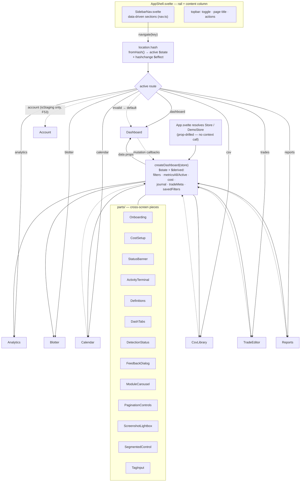

# App shell & routing

The redesigned sidebar shell + hash router, and how the `createDashboard` state factory feeds every
screen via props while screens push mutations back through callbacks.

**Source of truth:** [`src/app/App.svelte`](../../src/app/App.svelte) ·
[`src/lib/components/shell/AppShell.svelte`](../../src/lib/components/shell/AppShell.svelte) ·
[`src/lib/components/shell/SidebarNav.svelte`](../../src/lib/components/shell/SidebarNav.svelte) ·
[`src/app/lib/nav.ts`](../../src/app/lib/nav.ts) ·
[`src/app/lib/dashboard.svelte.ts`](../../src/app/lib/dashboard.svelte.ts).

## Route map

| Hash | Screen | Group |
| --- | --- | --- |
| `dashboard` | `Dashboard.svelte` | main |
| `calendar` | `Calendar.svelte` | main |
| `analytics` | `Analytics.svelte` | main |
| `blotter` | `Blotter.svelte` | main |
| `csv` | `CsvLibrary.svelte` | data management |
| `trades` | `TradeEditor.svelte` | data management |
| `reports` | `Reports.svelte` | data management |
| `account` | `Account.svelte` | Account (nav item only rendered when `isStaging`, F53) |

Missing/invalid hash defaults to `dashboard`. Hand-rolled hash router — **no SvelteKit** (ADR-001).

## Notes

- **Unidirectional data flow:** screens are prop-driven and never fetch/persist directly — they read
  derived state and call mutation callbacks on the dashboard factory, which owns the `Store` seam.
- Every dashboard mutation is `isDemo`-guarded so demo can't persist.
- **`account` is staging-gated (F53), not a permanent surfaces split.** `App.svelte` only adds the
  Account nav section and renders the lazy-loaded `Account.svelte` screen when `isStaging` — it ships
  to app/demo once the accounts backend (`ACCOUNTS_DB`, Stripe env vars) is set up and a
  `promote-staging` pass removes the gate (CH16 model).
