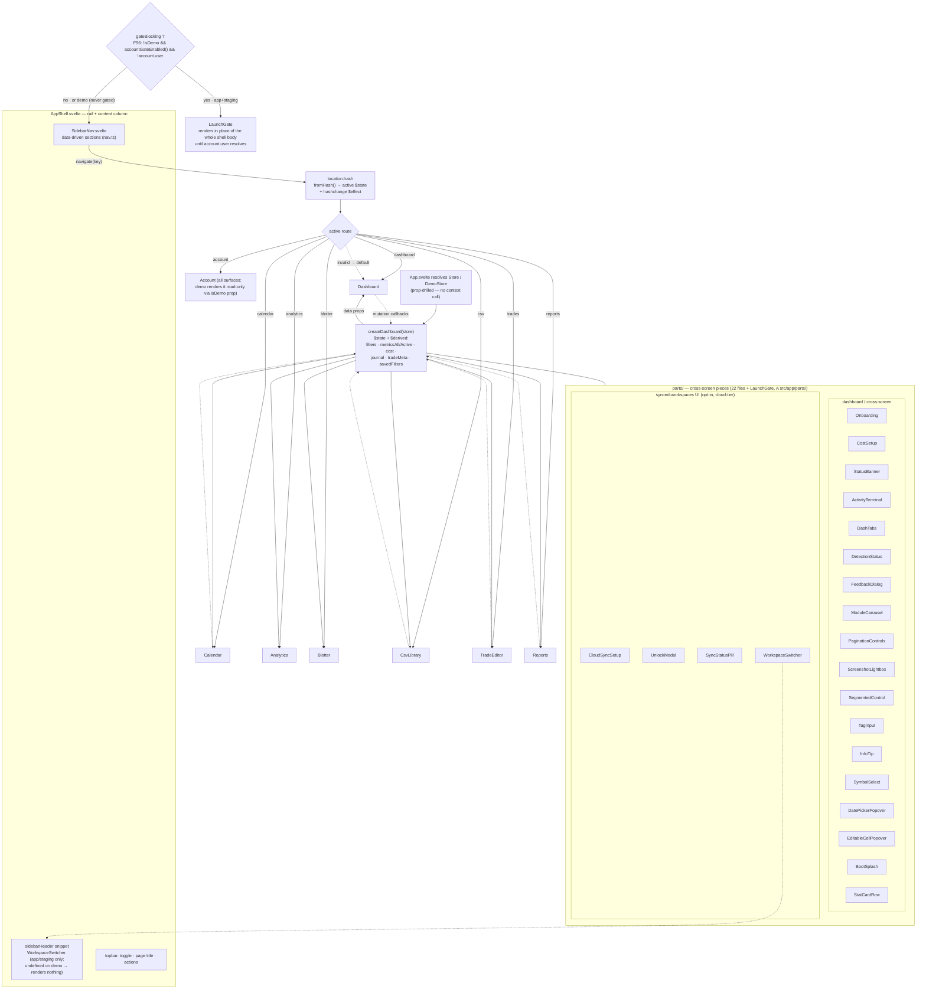

# App shell & routing

The redesigned sidebar shell + hash router, and how the `createDashboard` state factory feeds every
screen via props while screens push mutations back through callbacks.

**Source of truth:** [`src/app/App.svelte`](../../src/app/App.svelte) ·
[`src/lib/components/shell/AppShell.svelte`](../../src/lib/components/shell/AppShell.svelte) ·
[`src/lib/components/shell/SidebarNav.svelte`](../../src/lib/components/shell/SidebarNav.svelte) ·
[`src/app/lib/nav.ts`](../../src/app/lib/nav.ts) ·
[`src/app/lib/dashboard.svelte.ts`](../../src/app/lib/dashboard.svelte.ts).

## Route map

| Hash | Screen | Group |
| --- | --- | --- |
| `dashboard` | `Dashboard.svelte` | main |
| `calendar` | `Calendar.svelte` | main |
| `analytics` | `Analytics.svelte` | main |
| `blotter` | `Blotter.svelte` | main |
| `csv` | `CsvLibrary.svelte` | data management |
| `trades` | `TradeEditor.svelte` | data management |
| `reports` | `Reports.svelte` | data management |
| `account` | `Account.svelte` | Account (ships on all surfaces — demo renders it read-only, F53/CH16) |

Missing/invalid hash defaults to `dashboard`. Hand-rolled hash router — **no SvelteKit** (ADR-001).

## Notes

- **Unidirectional data flow:** screens are prop-driven and never fetch/persist directly — they read
  derived state and call mutation callbacks on the dashboard factory, which owns the `Store` seam.
- Every dashboard mutation is `isDemo`-guarded so demo can't persist.
- **`account` ships on every surface (F53/CH16 — promoted, not future).** `App.svelte:114` appends the
  Account nav section unconditionally and lazy-loads `Account.svelte` on every surface; demo passes
  `isDemo` down so the screen renders read-only and issues no account network traffic
  (`if (isDemo) return;` guards, `Account.svelte`). The `promote-staging` (CH16) pass that used to gate
  this already ran — there is no remaining gate to remove.
- **The F56 login gate (`LaunchGate`) is separate from the Account *screen*** — it's a shell-level
  hold (armed on app + staging, never demo) that blocks the whole router behind a sign-in ceremony
  before any screen renders; once `account.user` resolves the gate unmounts and routing proceeds
  normally, including to `account` itself.
- **`WorkspaceSwitcher`** renders into `AppShell`'s `sidebarHeader` snippet slot on app/staging only —
  `App.svelte` passes `sidebarHeader={isDemo ? undefined : sidebarHeader}`, so the slot (and the
  single-workspace switcher UI) is absent on demo by construction.
