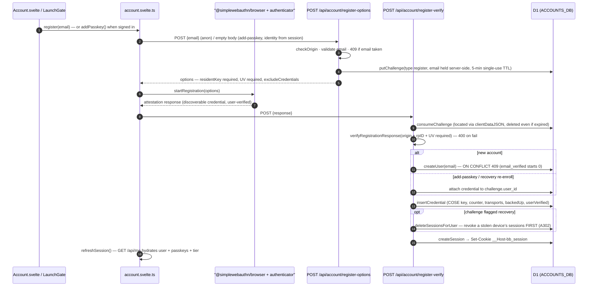
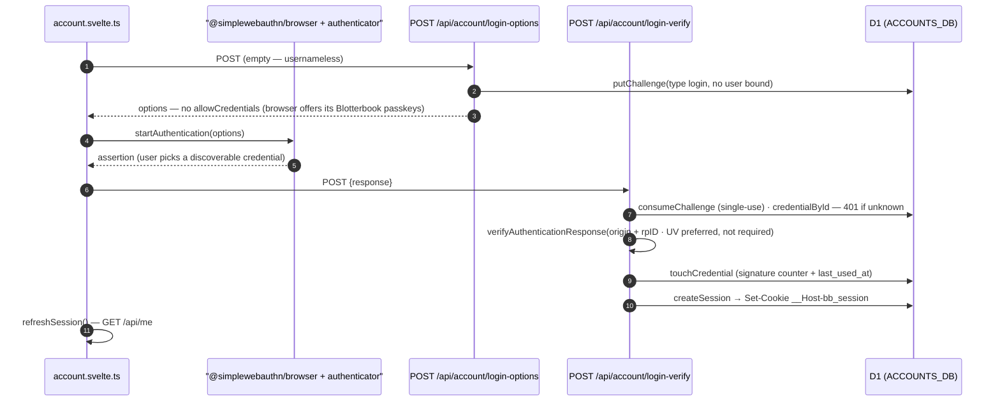
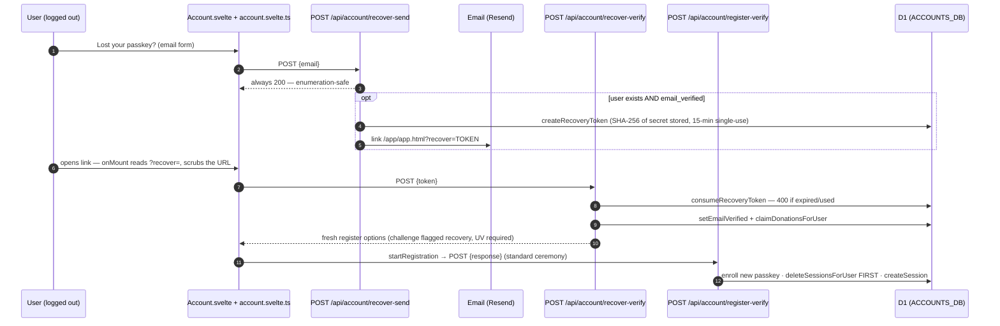
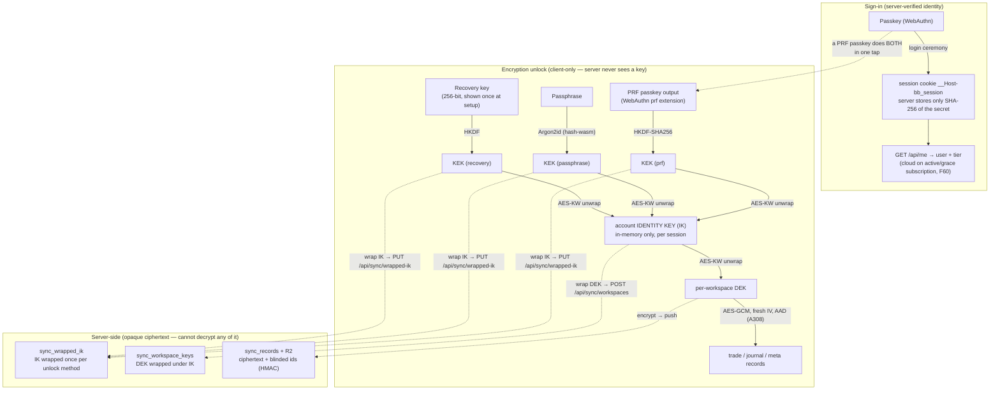
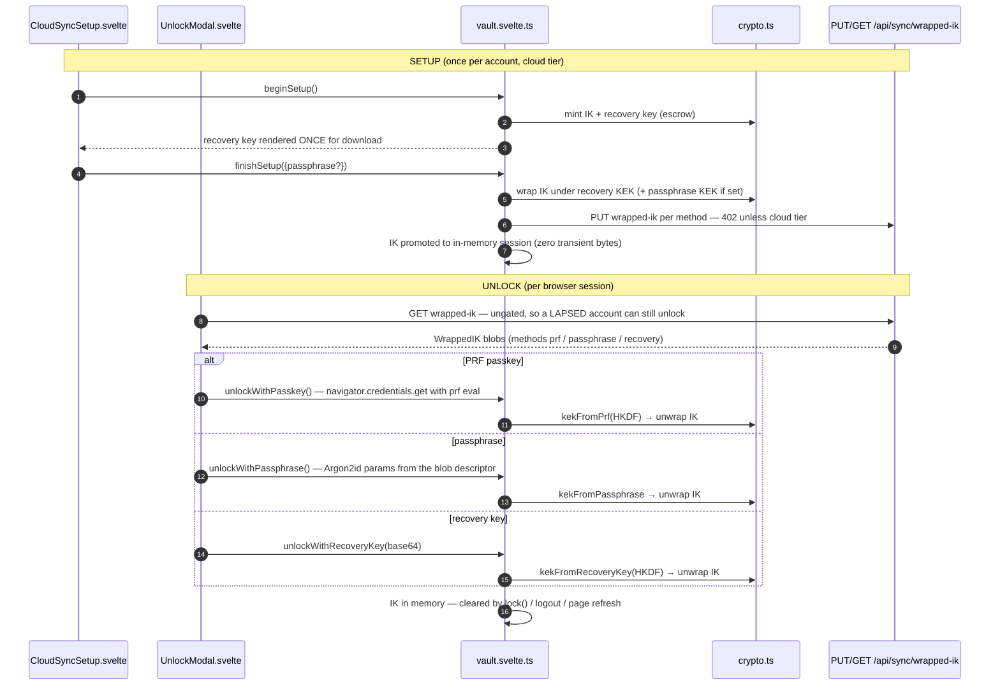

# Auth flow — passkeys, sessions, recovery & the E2E vault

How a user signs in and how sign-in relates to encryption. Four views: the WebAuthn registration
and login ceremonies, the lost-passkey recovery path, the two-secret key hierarchy (passkey =
sign-in, passphrase/recovery/PRF = encryption unlock), and the cloud-sync vault setup/unlock wiring.

**Source of truth:** [`functions/api/account/`](../../functions/api/account/) ·
[`functions/_lib/accounts.ts`](../../functions/_lib/accounts.ts) ·
[`functions/api/me.ts`](../../functions/api/me.ts) ·
[`functions/api/sync/wrapped-ik.ts`](../../functions/api/sync/wrapped-ik.ts) ·
[`src/app/lib/account.svelte.ts`](../../src/app/lib/account.svelte.ts) ·
[`src/app/lib/vault.svelte.ts`](../../src/app/lib/vault.svelte.ts) ·
[`src/lib/core/crypto.ts`](../../src/lib/core/crypto.ts) ·
[`src/app/parts/CloudSyncSetup.svelte`](../../src/app/parts/CloudSyncSetup.svelte) ·
[`src/app/parts/UnlockModal.svelte`](../../src/app/parts/UnlockModal.svelte).

## Registration ceremony (create account / add passkey)

## Login ceremony (usernameless / discoverable)

## Lost-passkey recovery (verified email → re-enroll)

## The two-secret model — sign-in vs. encryption unlock

## Cloud-sync vault setup & unlock (UI → endpoint → crypto)

## Notes

- **Session model:** the cookie value is opaque `id.secret`; the server persists only
  `SHA-256(secret)` (constant-time compare), so a D1 leak yields no usable token. 30-day sliding
  TTL with a 90-day absolute cap from creation (A302); `/api/me` re-issues the cookie so the
  browser's Max-Age tracks the slide. Logout deletes the session row by id (revocation-only, no
  secret required). `__Host-` forces Secure + Path=/ + no Domain; CSRF = SameSite=Lax plus an
  explicit Origin check on every mutating route.
- **Challenges and recovery tokens are single-use** and TTL'd (5 min / 15 min); a consumed or
  expired row is deleted on touch. The register ceremony requires user verification (UV); login
  accepts UV-preferred.
- **Email verification** (`email-verify-send` → emailed link → `email-verify-confirm`) flips
  `email_verified=1` and claims any pending donations. Recovery only ever emails a **verified**
  address, and `recover-send` answers 200 regardless — no account enumeration.
- **Two independent secrets:** the passkey proves identity to the *server*; the
  passphrase/recovery key/PRF output turns synced ciphertext back into plaintext in the *browser*.
  A PRF-capable passkey does both in one tap — but PRF must be requested at credential creation,
  so cloud sync enrolls a fresh PRF passkey (`registerPrfPasskey`, client-side extension only; no
  server change).
- **The server can never read** the IK, any DEK/KEK, the recovery key, or any plaintext trade
  field: it stores wrapped keys and AES-GCM ciphertext addressed by HMAC-blinded ids (S25). Keys
  live in module-scoped memory only and vanish on refresh/lock/logout.
- **Fail-closed plumbing:** every `/api/account/*` and `/api/sync/*` route 503s when
  `ACCOUNTS_DB` is unbound; the fail-open rate limiter is defense-in-depth only, never the control
  (S22).
