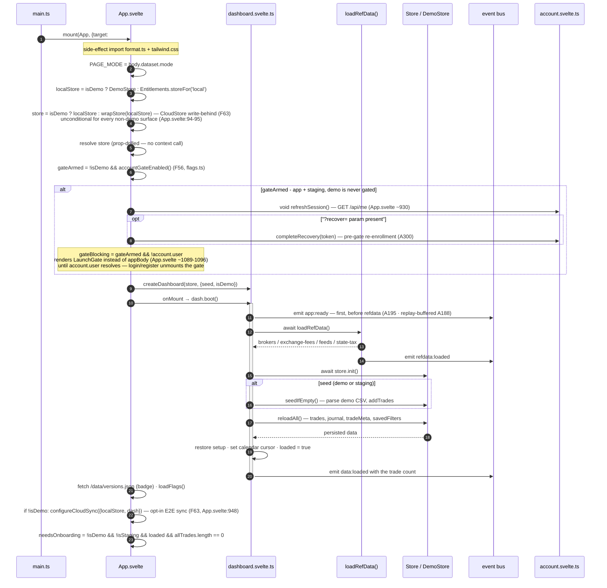

# Boot & lifecycle sequence

The ordered startup from `mount(App)` through reference-data load, store init, optional seeding,
data restore, and the first-run onboarding gate. One mode-aware `App.svelte` boots on every surface.

**Source of truth:** [`src/app/main.ts`](../../src/app/main.ts) ·
[`src/app/App.svelte`](../../src/app/App.svelte) ·
[`src/app/lib/dashboard.svelte.ts`](../../src/app/lib/dashboard.svelte.ts) ·
[`src/lib/core/core.ts`](../../src/lib/core/core.ts) (`loadRefData`, event bus).

## Notes

- **Seeding gate:** `SEEDED = isStaging || isDemo`. The real app (`data-mode="app"`) seeds nothing —
  an empty store is the first-run signal that shows onboarding.
- **Onboarding** appears only when `!isDemo && !isStaging && dash.loaded && !dash.allTrades.length`.
- **Demo never persists:** the in-memory `DemoStore` plus per-write `if (isDemo) return` guards
  (belt-and-suspenders) mean the boot path can seed demo in memory without ever touching disk.
- The event bus is a no-op when nothing is subscribed; `ActivityTerminal` is the usual listener.
- **Workspace-aware open (F59):** `Store.init()`/`open()` targets the *active* workspace's DB — the
  registry + active id live in `Store.local` (localStorage), read pre-paint so the correct
  `blotterbook:<uuid>` (or the legacy `blotterbook` Default) opens before first render.
- **Cloud sync is live on prod + staging (F58–F63), opt-in and `cloud`-tier only, never demo:** every
  non-demo surface wraps the store in a `CloudStore` and calls `configureCloudSync` unconditionally
  (`!isDemo`); the tier/opt-in gate is a runtime check inside the sync controller (A256), not a mode
  branch. Sync stays paused until a `cloud`-tier user opts a workspace in and unlocks the in-memory
  key (F61b), and every push/pull is E2E-encrypted ciphertext.
- **F56 login gate (2026-07-06 GA):** `gateArmed = !isDemo && accountGateEnabled()` — armed on app +
  staging, demo excluded by construction. When armed, `App.svelte` probes `/api/me` at `onMount` via
  `refreshSession()` (never throws) and, ahead of that, resolves a `?recover=` token pre-gate so a
  lost-passkey recovery link still works while `LaunchGate` is blocking. The whole shell renders
  `LaunchGate` instead of the normal body until `account.user` resolves; login/register flips
  `account.user` and the gate unmounts into the usual onboarding/dashboard flow.
