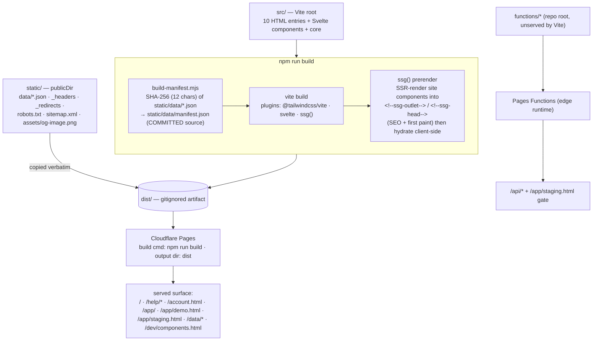

# Build & deploy flow

How `npm run build` turns `src/` + `static/` into the `dist/` artifact Cloudflare Pages serves,
including the manifest cache-bust step and the SSG prerender of the marketing pages.

**Source of truth:** [`vite.config.mjs`](../../vite.config.mjs) ·
[`scripts/build-manifest.mjs`](../../scripts/build-manifest.mjs) ·
[`scripts/vite-ssg.mjs`](../../scripts/vite-ssg.mjs) · [`package.json`](../../package.json) (`build`) ·
[ADR-001](../adr-001-vite-svelte-spa.md).

## The 15 entry points

| Group | Entries |
| --- | --- |
| Marketing/info (prerendered via SSG) | `index` · `help/*` (×5, A273) · `roadmap` · `changelog` · `legal` · `account` · `admin` |
| App surfaces (SPA shells) | `app/app` · `app/demo` · `app/staging` |
| Dev-only (noindex, robots-blocked) | `dev/components` (styleguide) |

## Notes

- **`build-manifest.mjs` writes a *committed source*, not `dist/`.** It hashes the reference-data JSON
  so the app can cache-bust with `?v=<hash>`. It's deterministic (no timestamps) so CI's drift gate
  can re-run it and assert the committed `manifest.json` matches — see
  [ci-pipeline.md](ci-pipeline.md).
- **URLs are preserved 1:1** from source paths — see [repo-layout-url-contract.md](repo-layout-url-contract.md).
- **No SvelteKit** (ADR-001); the marketing pages are SSG (prerender + hydrate), the app surfaces are
  client-rendered SPAs, and `functions/` deploy as edge functions automatically.
