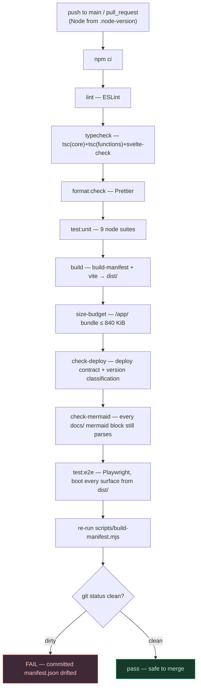

# CI pipeline & drift gate

The ordered `ci.yml` gates that run on every push to `main` and every pull request, ending with the
manifest drift gate that proves the build-time tooling left no committed source stale.

**Source of truth:** [`.github/workflows/ci.yml`](../../.github/workflows/ci.yml) ·
[`package.json`](../../package.json) (scripts) · [`.node-version`](../../.node-version).



## Notes

- **Any step is a hard gate** — lint, typecheck, format, unit, build, size-budget, deploy-contract,
  the Mermaid-diagram check, and e2e all fail the run on error. The diagram shows the happy path; a
  failure at any node stops it.
- **`check-mermaid`** parses every ```` ```mermaid ```` block under `docs/` (reuses the Playwright
  Chromium install) so a diagram edit that no longer parses fails CI instead of silently rendering as
  an error box on GitHub — see [the architecture-diagrams README](README.md#ci-drift-gate).
- **The drift gate is the finale.** Because `dist/` is gitignored, CI re-runs the deterministic
  `build-manifest.mjs` and asserts `git status` is clean — proving the committed
  `static/data/manifest.json` matches what the tooling produces. If you edit any `static/data/*.json`
  and forget to regenerate the manifest, this fails.
- **`check-deploy`** independently validates the deploy contract (source→URL assumptions) and the
  version-classification rules used by the [two-track bump](versioning-two-track.md).
- Concurrency cancels in-progress PR runs (not `main`); permissions are read-only.
- The **version bump** runs in a *separate* workflow on push to `main` — see
  [versioning-two-track.md](versioning-two-track.md).
