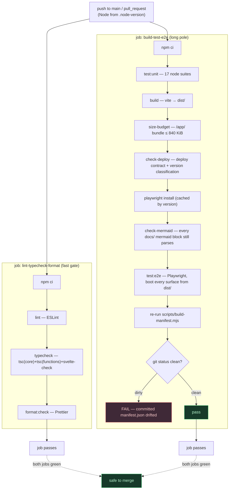

# CI pipeline & drift gate

`ci.yml` runs as **two independent, parallel jobs** (CH38) on every push to `main` and every pull
request: a fast `lint-typecheck-format` gate, and the longer `build-test-e2e` job that ends with the
manifest drift gate proving the build-time tooling left no committed source stale. Both must pass;
neither waits on the other.

**Source of truth:** [`.github/workflows/ci.yml`](../../.github/workflows/ci.yml) ·
[`package.json`](../../package.json) (scripts) · [`.node-version`](../../.node-version).



## Notes

- **Two parallel jobs, no join (CH38).** `lint-typecheck-format` is the cheap fast-feedback gate;
  `build-test-e2e` is the long pole (unit tests, the Vite build, size/deploy guards, and the
  Playwright boot). They run concurrently on independent runners — a failure in one does not block or
  cancel the other, and both must go green for the run to pass. This was split out of a single
  sequential job to cut wall-clock time to red/green on the fast gate.
- **`npm run ci`** (`package.json`) chains the same checks (`test` → `build` → `size-budget` →
  `check-deploy` → `test:e2e`) as a single local command a dev can run to reproduce the gist of both
  jobs before pushing; the workflow itself keeps named steps (not a call to `npm run ci`) so failures
  stay isolated per step in the Actions UI, and so the fast job doesn't redundantly re-run
  lint/typecheck/format inside `npm test`.
- **Any step is a hard gate** within its job — lint, typecheck, format, unit, build, size-budget,
  deploy-contract, the Mermaid-diagram check, and e2e all fail their job on error. The diagram shows
  the happy path; a failure at any node stops that job (the other job still runs to completion).
- **`check-mermaid`** parses every ```` ```mermaid ```` block under `docs/` (reuses the Playwright
  Chromium install from the same job) so a diagram edit that no longer parses fails CI instead of
  silently rendering as an error box on GitHub — see
  [the architecture-diagrams README](README.md#ci-drift-gate).
- **The drift gate is `build-test-e2e`'s finale.** Because `dist/` is gitignored, CI re-runs the
  deterministic `build-manifest.mjs` and asserts `git status` is clean — proving the committed
  `static/data/manifest.json` matches what the tooling produces. If you edit any `static/data/*.json`
  and forget to regenerate the manifest, this fails.
- **`check-deploy`** independently validates the deploy contract (source→URL assumptions) and the
  version-classification rules used by the [two-track bump](versioning-two-track.md).
- Concurrency cancels in-progress PR runs (not `main`); permissions are read-only.
- The **version bump** runs in a *separate* workflow on push to `main` — see
  [versioning-two-track.md](versioning-two-track.md).
