# Cloudflare Pages Functions (edge API)

The edge layer: the staging gate middleware, the public/admin API endpoints, the
passkey-accounts + Stripe donations/subscriptions backend, the F44 changelog-email subscriptions
subsystem, and the F62 encrypted-blob **sync** transport (R2 + D1) — all TypeScript functions
pinned at the repo root and deployed automatically by Pages.

**Source of truth:** [`functions/_middleware.ts`](../../functions/_middleware.ts) ·
[`functions/api/`](../../functions/api/) · [`functions/_lib/`](../../functions/_lib/) ·
[`functions/README.md`](../../functions/README.md).

```mermaid
flowchart TD
    REQ["Browser / fetch"] --> MW["_middleware.ts"]
    MW --> GATE{"path == /app/staging.html ?"}
    GATE -->|"yes"| AUTH{"valid admin token /<br/>ADMIN_KEY / bb_staging cookie ?"}
    AUTH -->|"valid"| PASS["serve staging shell"]
    AUTH -->|"invalid (or creds unset*)"| B403["403 — fail closed"]
    GATE -->|"no"| ROUTES

    subgraph ROUTES["functions/api/*"]
        direction TB
        GEO["GET /api/geo<br/>coarse region from request.cf · public 30m · called at boot by prefillStateFromGeo (A201)"]
        STAT["/api/status<br/>GET public 30s · POST admin → STATUS_KV"]
        CFG["/api/config<br/>GET flags public 60s · POST admin → STATUS_KV"]
        AK["GET /api/admin-key<br/>Cf-Access JWT (S4) → short-lived token"]
        ME["GET /api/me<br/>anon → {tier:'local'} · authed → + user/passkeys (F53)<br/>grants tier:'cloud' on active/grace subscription (F60)"]
        CO["POST /api/checkout<br/>Stripe Checkout session · 501 until STRIPE_SECRET_KEY set (F54)"]
        WH["POST /api/webhook<br/>verify Stripe sig (S11) → credit donation (F54)<br/>+ customer.subscription.* / invoice.payment_failed → subscriptions (F60)"]
    end

    subgraph CHLOG["functions/api/{subscribe,confirm,unsubscribe,notify-changelog}.ts — changelog email (F44)"]
        direction TB
        SUB["POST /api/subscribe<br/>same-origin double opt-in signup · enumeration-safe"]
        CONF["GET/POST /api/confirm?token=<br/>single-use link: pending → confirmed"]
        UNSUB["GET/POST /api/unsubscribe?token=<br/>one-click, no login · HARD-DELETES the row"]
        NOTIFY["POST /api/notify-changelog<br/>CHANGELOG_NOTIFY_SECRET trigger →<br/>reads changelog.json, batch-sends via Resend"]
    end

    subgraph SYNC["functions/api/sync/* — E2E encrypted-blob transport (F62)"]
        direction TB
        SWS["POST/GET /api/sync/workspaces<br/>register + wrapped DEK · list"]
        SIK["PUT/GET /api/sync/wrapped-ik<br/>account IK wrapped per unlock method"]
        SPU["POST /api/sync/push<br/>≤12 ciphertext records → R2 + monotonic seq (D1)"]
        SPL["GET /api/sync/pull?workspace_id&since<br/>records since seq cursor (ciphertext only)"]
        SDEL["POST /api/sync/delete<br/>erase a workspace's R2 blobs + D1 change-index ·<br/>paged · never paywalled (A254)"]
    end

    subgraph ACCT["functions/api/account/* (passkeys — F53/F55)"]
        direction TB
        REGO["POST register-options / register-verify<br/>WebAuthn registration ceremony"]
        LOGO["POST login-options / login-verify<br/>usernameless WebAuthn login ceremony"]
        OUT["POST logout"]
        EVS["POST email-verify-send / GET|POST email-verify-confirm<br/>verify recovery token → email_verified=1 + claims donations"]
        REC["POST recover-send / recover-verify<br/>lost-passkey magic link → fresh registration options"]
        RCL["POST reclaim-send / reclaim-confirm<br/>squatted-email reclaim: proof of inbox → frees the<br/>never-verified holder + fresh verified account (A316)"]
        PKD["POST passkey-delete<br/>remove a passkey · last-credential lockout guard (A302)"]
        DEL["POST delete<br/>two-phase resumable account deletion:<br/>clear owned sync workspaces, then D1 rows (A305, GDPR)"]
    end

    subgraph LIB["functions/_lib/"]
        AUTHL["auth.ts — issue/verify admin token · JWKS cache · Stripe sig · const-time cmp"]
        HTTPL["http.ts — json · cachedJson · purgeCached · rateLimited"]
        ACCTL["accounts.ts — D1 (ACCOUNTS_DB) users/credentials/sessions/challenges/<br/>donations/recovery_tokens/subscriptions · session cookie issue/verify · Origin checks"]
        SYNCL["sync.ts — R2 bucket · workspace ownership · LWW upsert · seq (F62)"]
        SUBL["subscribers.ts — D1 (ACCOUNTS_DB) subscribers/changelog_sends queries (F44)"]
        EMAILL["email.ts — Resend API wrapper (send/batch), shared by accounts + F44"]
    end

    ROUTES --- LIB
    ACCT --- LIB
    CHLOG --- LIB
    STAT -. "purge on POST" .-> KV[("STATUS_KV")]
    CFG -. "purge on POST" .-> KV
    STAT --- KV
    CFG --- KV
    ACCT -. "reads/writes" .-> D1[("ACCOUNTS_DB (D1)")]
    WH -. "reads/writes" .-> D1
    ME -. "reads" .-> D1
    CHLOG -. "reads/writes subscribers/changelog_sends" .-> D1
    SYNC --- LIB
    SYNC -. "change-index + wrapped keys" .-> D1
    SYNC -. "record ciphertext blobs" .-> R2[("SYNC_BUCKET (R2)")]
    DEL -. "clears owned workspaces first (A305)" .-> SYNC
```

## Endpoints

| Route | Auth | Purpose |
| --- | --- | --- |
| `GET /api/geo` | public | Visitor region (from `request.cf`) — called at boot by `prefillStateFromGeo()` (dashboard.svelte.ts) to pre-fill the tax state when none is set (A201; non-demo surfaces) |
| `GET/POST /api/status` | GET public · POST admin | Homepage "Live" indicator (KV-backed) |
| `GET/POST /api/config` | GET public · POST admin | Admin-managed feature flags read by the app at boot |
| `GET /api/admin-key` | Cloudflare Access JWT | Issue a short-lived signed admin token (S3/S4) |
| `GET /api/me` | public (session cookie optional) | Storage tier + account state — anonymous/no `ACCOUNTS_DB`/expired session → `{tier:'local',cloudSync:false}`; a valid session adds `user`/`passkeys` (F53); **grants `{tier:'cloud',cloudSync:true}` while a subscription is active / within dunning grace / before `current_period_end` (F60), or while a live A276 admin override exists (`hasCloudEntitlement`)** |
| `POST /api/account/register-options`, `register-verify` | public / session | WebAuthn passkey registration ceremony — creates `users`+`credentials`, sets the session cookie (F53) |
| `POST /api/account/login-options`, `login-verify` | public | Usernameless WebAuthn login (assertion) ceremony, sets the session cookie (F53) |
| `POST /api/account/logout` | session cookie | Deletes the session row + expires the cookie (F53) |
| `POST /api/account/email-verify-send`, `GET\|POST email-verify-confirm` | session (send) / token (confirm) | Single-use recovery-token email verification; confirms also claims unclaimed donations by matching email |
| `POST /api/account/recover-send`, `recover-verify` | public | "Lost your passkey?" magic-link recovery → fresh WebAuthn registration options, no account enumeration |
| `POST /api/account/reclaim-send`, `reclaim-confirm` | public | Squatted-email reclaim (A316): proof-of-inbox magic link frees a never-verified holder and pre-creates a fresh verified account; enumeration-safe generic 200 on send |
| `GET /api/admin/users`, `POST /api/admin/entitlement` | admin token (Access-minted) | A276 user table (cursor-paginated, S25-safe fields) + manual cloud-comp grant/revoke over the audit-trailed `entitlement_overrides` table; `hasCloudEntitlement` = override OR subscription, shared by `/api/me` + the sync paywall |
| `POST /api/subscription/create` | session cookie | A278 in-app Payment Element bootstrap — incomplete subscription + PaymentIntent client secret; the webhook remains the only tier writer |
| `POST /api/checkout` | Origin-checked | Creates a Stripe Checkout session over the REST API (no SDK); `501 not_configured` until `STRIPE_SECRET_KEY`/price env vars are set |
| `POST /api/webhook` | Stripe signature (S11) | Verifies the raw-body signature, then on `checkout.session.completed` credits/claims a donation, and on `customer.subscription.created/updated/deleted` + `invoice.payment_failed` upserts a `subscriptions` row with `status` + `current_period_end` (F60); dedup on the Stripe event id (`webhook_events`); `501` until `STRIPE_WEBHOOK_SECRET` is set |
| `POST /api/subscribe` | public (same-origin) | Changelog-email double opt-in signup — writes a `pending` row + emails a confirm link; one generic 200 for new/pending/confirmed (enumeration-safe, F44) |
| `GET\|POST /api/confirm` | token (query) | Consumes the single-use confirm link (`pending → confirmed`); GET redirects to `/changelog.html?subscribed=1` (F44) |
| `GET\|POST /api/unsubscribe` | token (query) | One-click, no-login hard delete of the subscriber row; also sent via `List-Unsubscribe(-Post)` headers (F44) |
| `POST /api/notify-changelog` | `CHANGELOG_NOTIFY_SECRET` (const-time compare) | Send trigger — reads `/data/changelog.json`, dedupes via `changelog_sends`, batch-sends (Resend) to confirmed subscribers; called by `changelog-email.yml` at the `pages.dev` origin (A315 — the custom domain's Bot Fight Mode blocks the runner), with `PUBLIC_ORIGIN` branding the unsubscribe link and a `?version=` gate answering 425 until the deploy is live (F44) |
| `POST /api/account/passkey-delete` | session cookie · Origin | Remove one of the caller's passkeys, scoped to the caller; refuses to delete the last remaining credential (lockout guard, A302) |
| `POST /api/account/delete` | session cookie · Origin | Permanently delete the caller's account + all data — two-phase resumable: page-clear owned sync workspaces (R2 + D1) first, then explicit D1 deletes of every user-keyed row; no cloud-tier gate (A305, GDPR) |
| `POST/GET /api/sync/workspaces` | session cookie · Origin (POST) | Register (owned upsert) a workspace + its wrapped DEK + optional encrypted name / list the caller's workspaces (F62). Fail-closed 503 without `ACCOUNTS_DB`+`SYNC_BUCKET` |
| `PUT/GET /api/sync/wrapped-ik` | session cookie · Origin (PUT) | Store/fetch the account IK wrapped per unlock method (`prf`/`passphrase`/`recovery`) — opaque blobs (F62) |
| `POST /api/sync/push` | session cookie · Origin | Store ≤12 ciphertext records in R2, upsert the D1 change-index under a monotonic per-workspace `seq`, LWW; cross-user/nonexistent workspace → 404; over-cap → 413 (F62) |
| `GET /api/sync/pull` | session cookie | Return records with `seq > since` (≤25/page) + `nextSince`/`more` — ciphertext + blinded ids only, never a plaintext trade field or name (F62) |
| `POST /api/sync/delete` | session cookie · Origin | Erase a caller-owned workspace's synced copy — pages R2 blobs + D1 change-index, then drops the wrapped-DEK + registry rows; client loops while `done:false`; never paywalled (A254) |

## Notes

- **Staging gate fails closed.** If `ADMIN_KEY`/`TOKEN_SECRET` is configured, an invalid credential
  gets `403`; if neither is set, it *also* blocks (403) unless `ALLOW_PRESENCE_AUTH=1` (local/preview
  only) — a misconfigured deploy can't accidentally expose staging. (*the "unset" case.)
- **Defense in depth:** admin writes are rate-limited (fixed-window, KV-backed) and edge-cache entries
  are purged immediately on POST. `admin-key` verifies the Access JWT against the team JWKS when
  `ACCESS_TEAM_DOMAIN`+`ACCESS_AUD` are set (S4).
- **Accounts (passkeys-only, guardrail S25) + Stripe donations/subscriptions are real, not scaffold** —
  the `functions/api/account/*` ceremony endpoints, `/api/me` (with the F60 `cloud`-tier grant), and
  `/api/checkout`+`/api/webhook` (donations F54 + subscription lifecycle F60) are implemented against
  `functions/schema.sql` (D1, bound as `ACCOUNTS_DB`); every route **fails closed** (503 JSON) until that
  binding exists, and Stripe endpoints fail closed (501) until their env vars are set. Identity +
  entitlements only — no *plaintext* trade data ever reaches D1 (S25).
- **The synced-workspaces transport (F62) is live** — `/api/sync/*` is a deliberately dumb
  **encrypted-blob store** over R2 (`SYNC_BUCKET`, ciphertext) + D1 (`ACCOUNTS_DB`, change-index +
  wrapped keys): session-gated, Origin-checked on mutations, **fails closed (503)** without either
  binding, and a cross-user/nonexistent workspace answers 404. It stores/returns **only** ciphertext +
  blinded ids + timestamps — never a symbol, P&L, note, tag, or workspace name (S25, strengthened).
- **Cloud sync is GA on prod** (2026-07-07): the Account screen ships on every surface (demo
  read-only) and the whole cloud-sync client (`CloudStore`, key setup/unlock UI) wraps every
  non-demo `Store` unconditionally — the `cloud`-tier opt-in is a runtime check inside the sync
  controller, not a surface gate. See `functions/README.md` for the operational setup steps.
- **The changelog-email subsystem (F44)** shares `ACCOUNTS_DB` (D1) with the accounts backend but is
  a separate, single-purpose `subscribers`/`changelog_sends` pair of tables — email address +
  changelog content only, never trade data (S25/A141). All four endpoints fail closed (503) without
  `ACCOUNTS_DB`/`RESEND_API_KEY`.
- Functions **fail soft** when `STATUS_KV` is unbound (GET falls back to defaults; admin POST → 500).
