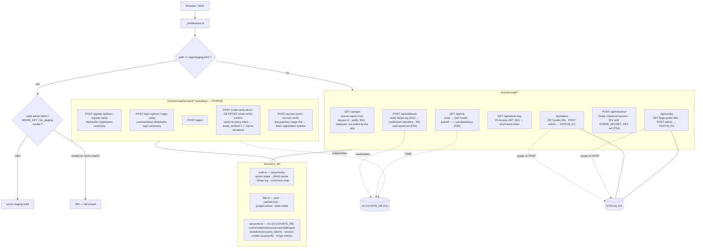

# Cloudflare Pages Functions (edge API)

The edge layer: the staging gate middleware, the public/admin API endpoints, and the
passkey-accounts + Stripe-donations backend — all TypeScript functions pinned at the repo root and
deployed automatically by Pages.

**Source of truth:** [`functions/_middleware.ts`](../../functions/_middleware.ts) ·
[`functions/api/`](../../functions/api/) · [`functions/_lib/`](../../functions/_lib/) ·
[`functions/README.md`](../../functions/README.md).

## Endpoints

| Route | Auth | Purpose |
| --- | --- | --- |
| `GET /api/geo` | public | Visitor region (from `request.cf`) — deployed but currently NOT called by the app (candidate: pre-fill the tax-state selector) |
| `GET/POST /api/status` | GET public · POST admin | Homepage "Live" indicator (KV-backed) |
| `GET/POST /api/config` | GET public · POST admin | Admin-managed feature flags read by the app at boot |
| `GET /api/admin-key` | Cloudflare Access JWT | Issue a short-lived signed admin token (S3/S4) |
| `GET /api/me` | public (session cookie optional) | Storage tier + account state — anonymous/no `ACCOUNTS_DB`/expired session → `{tier:'local',cloudSync:false}`; a valid session adds `user`/`passkeys` (F53) |
| `POST /api/account/register-options`, `register-verify` | public / session | WebAuthn passkey registration ceremony — creates `users`+`credentials`, sets the session cookie (F53) |
| `POST /api/account/login-options`, `login-verify` | public | Usernameless WebAuthn login (assertion) ceremony, sets the session cookie (F53) |
| `POST /api/account/logout` | session cookie | Deletes the session row + expires the cookie (F53) |
| `POST /api/account/email-verify-send`, `GET\|POST email-verify-confirm` | session (send) / token (confirm) | Single-use recovery-token email verification; confirms also claims unclaimed donations by matching email |
| `POST /api/account/recover-send`, `recover-verify` | public | "Lost your passkey?" magic-link recovery → fresh WebAuthn registration options, no account enumeration |
| `POST /api/checkout` | Origin-checked | Creates a Stripe Checkout session over the REST API (no SDK); `501 not_configured` until `STRIPE_SECRET_KEY`/price env vars are set |
| `POST /api/webhook` | Stripe signature (S11) | Verifies the raw-body signature, then on `checkout.session.completed` credits/claims a donation (dedup on the Stripe event id); `501` until `STRIPE_WEBHOOK_SECRET` is set |

## Notes

- **Staging gate fails closed.** If `ADMIN_KEY`/`TOKEN_SECRET` is configured, an invalid credential
  gets `403`; if neither is set, it *also* blocks (403) unless `ALLOW_PRESENCE_AUTH=1` (local/preview
  only) — a misconfigured deploy can't accidentally expose staging. (*the "unset" case.)
- **Defense in depth:** admin writes are rate-limited (fixed-window, KV-backed) and edge-cache entries
  are purged immediately on POST. `admin-key` verifies the Access JWT against the team JWKS when
  `ACCESS_TEAM_DOMAIN`+`ACCESS_AUD` are set (S4).
- **Accounts (passkeys-only, guardrail S25) + Stripe donations are real, not scaffold** — the
  `functions/api/account/*` ceremony endpoints, `/api/me` extension, and `/api/checkout`+`/api/webhook`
  donation flow are implemented against `functions/schema.sql` (D1, bound as `ACCOUNTS_DB`); every
  route **fails closed** (503 JSON) until that binding exists, and Stripe endpoints fail closed (501)
  until their env vars are set. Identity + entitlements only — no trade data ever reaches D1 (S25).
  The Account screen is currently **staging-gated** (`isStaging` in `src/app/App.svelte`, F53) pending
  the owner's D1/Stripe setup and a `promote-staging` pass; a full storage-tier `CloudStore` behind the
  same `Store` seam is still future work. See `functions/README.md` for the operational setup steps.
- Functions **fail soft** when `STATUS_KV` is unbound (GET falls back to defaults; admin POST → 500).
