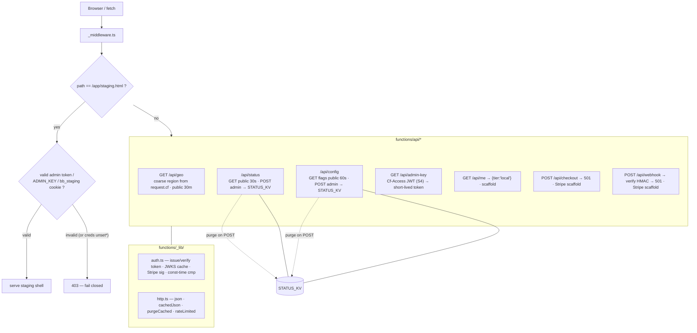

# Cloudflare Pages Functions (edge API)

The edge layer: the staging gate middleware, the public/admin API endpoints, and the Stripe/accounts
scaffold — all TypeScript functions pinned at the repo root and deployed automatically by Pages.

**Source of truth:** [`functions/_middleware.ts`](../../functions/_middleware.ts) ·
[`functions/api/`](../../functions/api/) · [`functions/_lib/`](../../functions/_lib/) ·
[`functions/README.md`](../../functions/README.md).

## Endpoints

| Route | Auth | Purpose |
| --- | --- | --- |
| `GET /api/geo` | public | Visitor region (from `request.cf`) to pre-fill the tax-state selector |
| `GET/POST /api/status` | GET public · POST admin | Homepage "Live" indicator (KV-backed) |
| `GET/POST /api/config` | GET public · POST admin | Admin-managed feature flags read by the app at boot |
| `GET /api/admin-key` | Cloudflare Access JWT | Issue a short-lived signed admin token (S3/S4) |
| `GET /api/me` | public | Storage tier — always `{tier:'local'}` (accounts scaffold) |
| `POST /api/checkout` | (future) | Stripe Checkout — returns `501 not_implemented` |
| `POST /api/webhook` | Stripe HMAC | Stripe webhook — verifies signature, returns `501` |

## Notes

- **Staging gate fails closed.** If `ADMIN_KEY`/`TOKEN_SECRET` is configured, an invalid credential
  gets `403`; if neither is set, it *also* blocks (403) unless `ALLOW_PRESENCE_AUTH=1` (local/preview
  only) — a misconfigured deploy can't accidentally expose staging. (*the "unset" case.)
- **Defense in depth:** admin writes are rate-limited (fixed-window, KV-backed) and edge-cache entries
  are purged immediately on POST. `admin-key` verifies the Access JWT against the team JWKS when
  `ACCESS_TEAM_DOMAIN`+`ACCESS_AUD` are set (S4).
- **Stripe/accounts is scaffold only** — `checkout`/`webhook`/`me` return placeholders; the live
  storage tier (a `CloudStore` behind the same `Store` seam) is future work.
- Functions **fail soft** when `STATUS_KV` is unbound (GET falls back to defaults; admin POST → 500).
