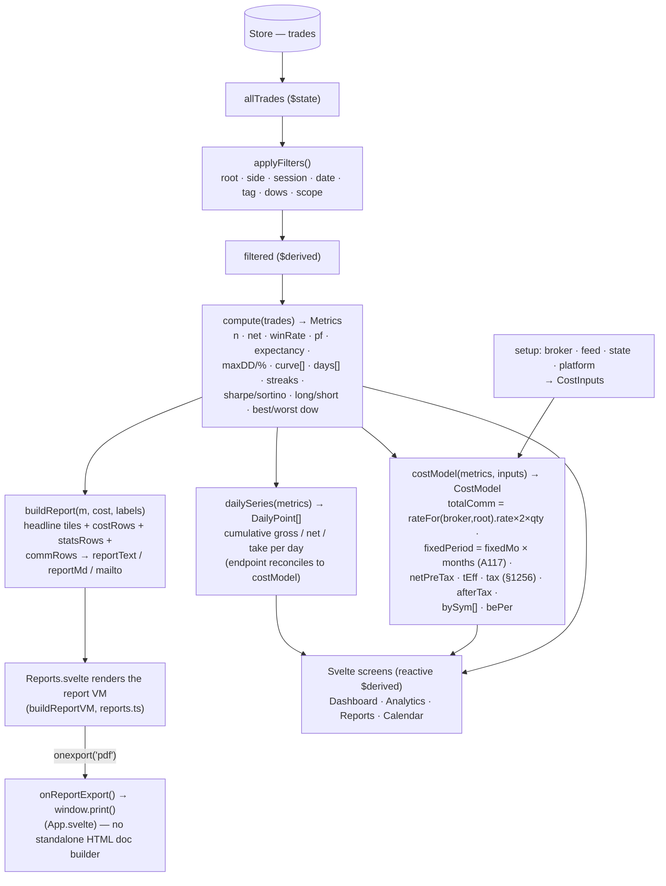

# Compute → cost model → render pipeline

How persisted trades flow through filtering, metric computation, the cost/tax model, the equity
curve series, and the report builder into the reactive screens.

**Source of truth:** [`src/lib/core/core.ts`](../../src/lib/core/core.ts) (`compute`, `costModel`,
`rateFor`) · [`src/lib/core/curveseries.ts`](../../src/lib/core/curveseries.ts) (`dailySeries`) ·
[`src/lib/core/report.ts`](../../src/lib/core/report.ts) · [`src/app/lib/dashboard.svelte.ts`](../../src/app/lib/dashboard.svelte.ts).

## Notes

- **`compute()` is pure** — trades in, a ~35-field `Metrics` object out (counts, PnL totals, ratios,
  realized drawdown, equity `curve[]`, per-day aggregates, streaks, daily Sharpe/Sortino, side splits,
  day-of-week extremes). No framework, node-tested.
- **`costModel()`** layers real-world costs on top: round-turn commissions (`rate × 2 × qty` via
  `rateFor(broker, root)` against the reference-data fee tables), fixed monthly subscriptions accrued
  across **every** calendar month spanned (not just active ones — A117), a §1256 + state blended tax
  estimate, and a per-symbol commission breakdown.
- **`dailySeries()`** shares the same commission/subscription/tax math so the curve's endpoint
  reconciles exactly with `costModel.netPreTax`/`afterTax` (guarded by the `curveandreport` suite).
- Screens hold **no business logic** — they render `$derived` views of these pure outputs.
- **`report.ts` exports only `buildReport()`** — there is no `reportHtmlDoc()`/standalone-HTML builder
  in the pure core. PDF export is `window.print()` on the already-rendered `Reports` screen
  (`Reports.svelte` → `buildReportVM` in `src/app/lib/reports.ts` → `App.svelte`'s `onReportExport`,
  invoked via the `onexport` callback with `kind === 'pdf'`).
