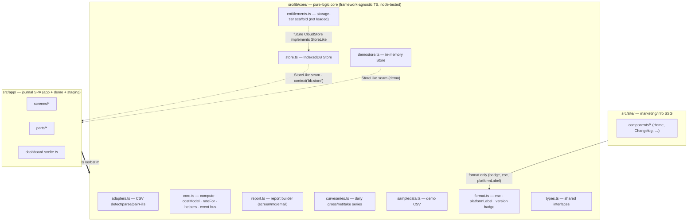

# Pure-logic core reuse map

The framework-agnostic `src/lib/core/` is reused verbatim by the journal app and (partly) the info
site, and the `Store` interface is the seam a future `CloudStore` drops into.

**Source of truth:** [`src/lib/core/`](../../src/lib/core/) ·
[`src/lib/core/store.ts`](../../src/lib/core/store.ts) (the seam) ·
[`src/lib/core/types.ts`](../../src/lib/core/types.ts) (`StoreLike`).

## Notes

- **One core, three consumers.** The app drives the full pipeline; the info site pulls only
  `format.ts` (shared version badge + escaping). The core is native TS (A61) and node-tested by the
  standalone suites (`scripts/test-*.mjs`) with **no DOM/framework**.
- **The `Store` seam is the extension point.** The app only ever talks to a `StoreLike` object via
  `context('bb:store')` — real IndexedDB (`store.ts`), in-memory (`demostore.ts`), or a future
  server-backed `CloudStore` (the subscription tier sketched in `entitlements.ts` / `functions/`).
  Swapping the backend changes no screen code.
