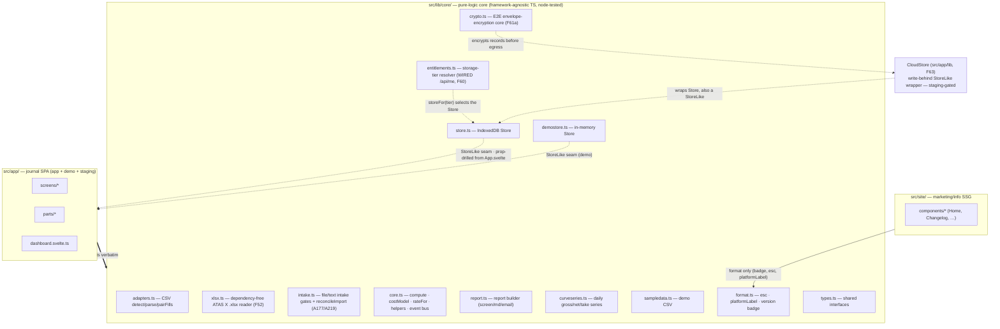

# Pure-logic core reuse map

The framework-agnostic `src/lib/core/` is reused verbatim by the journal app and (partly) the info
site, and the `Store` interface is the seam a future `CloudStore` drops into.

**Source of truth:** [`src/lib/core/`](../../src/lib/core/) ·
[`src/lib/core/store.ts`](../../src/lib/core/store.ts) (the seam) ·
[`src/lib/core/types.ts`](../../src/lib/core/types.ts) (`StoreLike`).

## Notes

- **One core, three consumers.** The app drives the full pipeline; the info site pulls only
  `format.ts` (shared version badge + escaping). The core is native TS (A61) and node-tested by the
  standalone suites (`scripts/test-*.mjs`) with **no DOM/framework**.
- **The `Store` seam is the extension point.** The app only ever talks to a `StoreLike` object that
  `App.svelte` resolves and prop-drills (into `createDashboard`/`createDashTabs` and down through the
  screens/parts — no `context()` call) — real IndexedDB (`store.ts`), in-memory (`demostore.ts`), or the
  `CloudStore` write-behind wrapper (`src/app/lib/cloudstore.ts`, F63 — selected on the `cloud` tier via
  `entitlements.ts`, staging-gated today). Swapping the backend changes no screen code.
- **`entitlements.ts` is now wired (F60)**, not a scaffold: `current()` calls `/api/me` to resolve the
  tier and `storeFor()` picks the `Store`. **`crypto.ts` (F61a)** is the pure E2E envelope-encryption
  core (AES-KW/GCM/HKDF/HMAC + Argon2id via `hash-wasm`), node-tested by `scripts/test-crypto.mjs`; the
  `CloudStore` uses it to encrypt every record before it leaves the browser.
