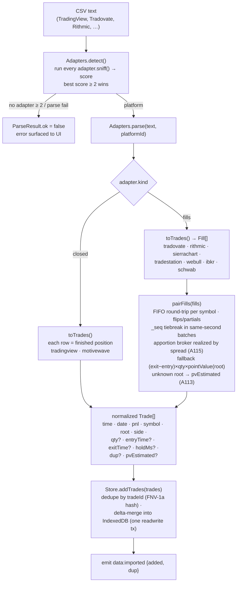

# CSV import → adapters pipeline

How a raw balance-history CSV is sniffed to a platform, parsed by the matching adapter, and (for
execution-level exports) round-trip matched into normalized closed trades before persistence.

**Source of truth:** [`src/lib/core/adapters.ts`](../../src/lib/core/adapters.ts) ·
[`src/lib/core/store.ts`](../../src/lib/core/store.ts) (`addTrades`, `tradeId`) ·
[`src/lib/core/types.ts`](../../src/lib/core/types.ts) (`Trade` / `Fill`).

## Adapters

| Adapter | Kind | Status |
| --- | --- | --- |
| `tradingview` | closed | production |
| `motivewave` | closed | beta |
| `tradovate`, `rithmic`, `sierrachart`, `tradestation`, `webull`, `ibkr`, `schwab` | fills | beta |

- **closed** exports carry realized PnL per row; **fills** exports are individual executions that
  `pairFills()` turns into closed trades via a FIFO round-trip matcher.
- Every adapter emits the **same normalized `Trade` shape**, so `compute()`/`costModel()` never
  change when a platform is added — the whole reason the seam exists (add an adapter = one object in
  `adapters.ts` + a fixture in `scripts/test-adapters.mjs`).
- **Dedupe** is content-addressed: `tradeId = FNV-1a(time|symbol|side|pnl[|dup])`, so re-uploading an
  overlapping CSV only inserts genuinely new rows.
