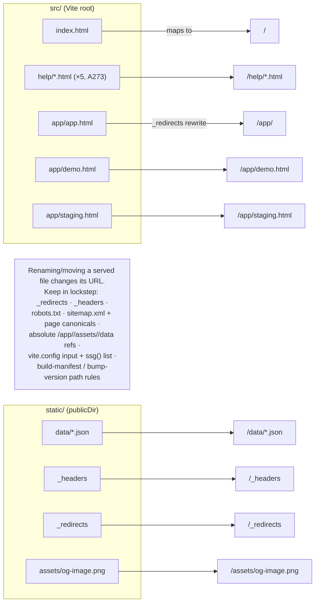

# Repo layout → URL deploy contract

The Vite root is `src/` and the publicDir is `static/`; each maps to a URL 1:1 in `dist/`. Source
paths are decoupled from URLs, but renaming a *served* file changes its URL and must be kept in
lockstep across several files.

**Source of truth:** [`vite.config.mjs`](../../vite.config.mjs) (`root`/`publicDir`/`outDir`/`input`) ·
[`static/_redirects`](../../static/_redirects) · [`static/_headers`](../../static/_headers) ·
[the deploy contract](../architecture.md#repository-layout--the-deploy-contract).

## Notes

- **`src/` = bundled/served; `static/` = copied verbatim to the `dist/` root.** So `src/index.html`
  → `/`, `src/app/app.html` → `/app/app.html`, `static/data/` → `/data/`, `static/_headers` →
  `/_headers`.
- **`/app/` is a rewrite:** `static/_redirects` maps `/app/` → `/app/app.html`. A blanket
  `/* /index.html 200` catch-all would break the marketing pages and the demo/staging surfaces, so
  routing is explicit.
- **`functions/`, `scripts/`, and tooling stay at the repo root, unserved.** Only `src/` and
  `static/` reach the browser.
- Guardrail A18 (source path == URL) was **retired** — paths are decoupled — but the lockstep list
  above is the price of moving a served file.
