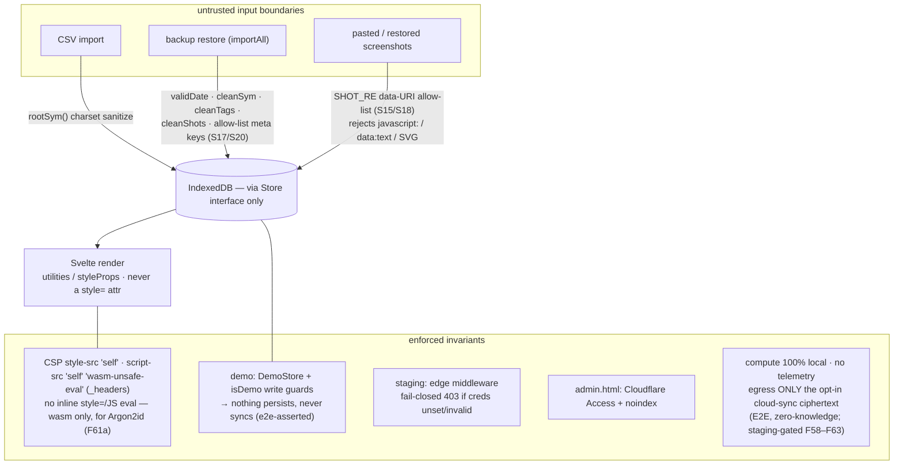

# Security model & trust boundaries

Where untrusted input is sanitized, and the invariants that keep the local-only trust model intact:
CSP, demo non-persistence, the staging fail-closed gate, and admin gating.

**Source of truth:** [`src/lib/core/store.ts`](../../src/lib/core/store.ts) (`importAll`, `SHOT_RE`,
`validShot`) · [`src/lib/core/adapters.ts`](../../src/lib/core/adapters.ts) (`rootSym`) ·
[`static/_headers`](../../static/_headers) (CSP) · [`functions/_middleware.ts`](../../functions/_middleware.ts).

## Notes

- **Sanitize at the trust boundary, not the sink.** CSV symbols route through `rootSym()`; a restored
  backup is treated as fully untrusted — dates must be canonical `YYYY-MM-DD`, symbols re-sanitized,
  tags stripped of markup + lowercased, `meta` keys allow-listed (only `setup`/`savedFilters`, with
  `savedFilters` shape-validated), and screenshots kept only if they match `SHOT_RE` (well-formed
  base64 image data URIs). The live capture path shares the exact same `validShot` allow-list.
- **CSP `style-src 'self'` holds.** Tailwind ships as a linked stylesheet of classes; dynamic styles
  use the `styleProps` CSSOM action — **never** a literal `style=""` attribute. (bits-ui/Floating-UI
  positioning writes `element.style` via CSSOM, which isn't gated by `style-src`.)
- **Demo can't persist by construction** (in-memory `DemoStore`) *and* by guard (`if (isDemo) return`
  on every write) *and* by UI (controls disabled) — three independent layers; e2e asserts no
  Blotterbook IndexedDB is created on demo.
- **Staging fails closed** at the edge, and **admin** is Cloudflare Access-gated + `noindex`.
- **The model rests on local compute** — no telemetry; compute never touches the network. The only
  network calls are static `/data/*.json` reference data, the optional public `/api/*` niceties (geo,
  status, flags), and — on the **staging-gated** opt-in cloud-sync path (F58–F63) — **ciphertext + blinded
  ids** over `/api/sync/*`. That sync path is refined-moat-safe: records are AES-GCM-encrypted with an
  in-memory per-workspace key the server never sees (zero-knowledge — [`synced-workspaces.md`](../synced-workspaces.md)),
  pulled records re-enter through the **same** `importAll` sanitizers as a backup restore, and prod/demo
  never construct a `CloudStore`. The one CSP relaxation is `script-src 'wasm-unsafe-eval'` for the
  Argon2id **wasm** only (`'unsafe-inline'`/`'unsafe-eval'` stay absent).
