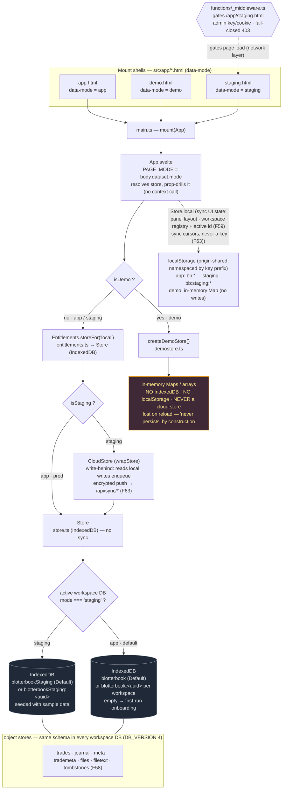

# Storage & mode separation

How the three app surfaces (**prod / demo / staging**) select a `Store` at boot and how their data
is kept isolated. The whole app talks to one `Store` interface; only *which* implementation and
*which* backing database it gets differs per surface.

**Source of truth:** [`src/lib/core/store.ts`](../../src/lib/core/store.ts) ·
[`src/lib/core/demostore.ts`](../../src/lib/core/demostore.ts) ·
[`src/app/App.svelte`](../../src/app/App.svelte) ·
[`src/lib/core/core.ts`](../../src/lib/core/core.ts) (`PAGE_MODE`) ·
[`functions/_middleware.ts`](../../functions/_middleware.ts) (staging edge gate).

## How separation actually happens

Two *different* mechanisms — not one shared switch:

| Surfaces | Isolation mechanism | Where |
| --- | --- | --- |
| **prod vs staging** | Same `Store`/IndexedDB engine, **different database name** (`blotterbook` vs `blotterbookStaging`). IndexedDB is origin-scoped, but named DBs are fully isolated, so the two never see each other's rows. | `store.ts` `DB_NAME` ternary |
| **demo vs everything** | A **different `Store` implementation** (`DemoStore`) backed by in-memory `Map`s — it never calls `indexedDB.open` at all, so it can't touch (or pollute) the prod `blotterbook` DB. | `App.svelte` store swap |

## Notes / gotchas

- **The `DB_NAME` ternary maps both `app` *and* `demo` to `blotterbook`.** Demo is safe *only*
  because it never uses the real `Store`. If demo ever fell through to `Store`, it would write into
  the prod DB. That's why demo has belt-and-suspenders on top of the swap: every write path is
  `isDemo`-guarded (`if (isDemo) return;`) and the UI disables each data-writing control. The e2e
  suite asserts **no** Blotterbook IndexedDB is created on the demo surface.
- **Staging has a second, independent layer of protection:** the edge middleware gates the page
  itself (admin credential required; **fails closed with 403** if `ADMIN_KEY` is unset). This is
  access control, orthogonal to the data isolation above. Prod and demo are public.
- **All access funnels through the `Store` interface** — the app never touches `indexedDB` directly,
  so the `CloudStore` write-behind wrapper (F63, `cloud` subscription tier) drops in behind the same
  async methods. On **staging only** `App.svelte` resolves the store through `Entitlements.storeFor()`
  and wraps it in `CloudStore` (`wrapStore`) for opt-in E2E sync; prod/demo never construct one.
- **Named workspaces (F59):** the store is now workspace-scoped — each named workspace is its **own**
  IndexedDB DB (`blotterbook:<uuid>`), while the pre-F59 **Default** keeps the legacy DB name
  (`blotterbook`/`blotterbookStaging`) so existing data is used in place. The `DB_NAME` seam that
  already split prod vs. staging now also selects the active workspace's DB; the registry + active id
  live in `Store.local`.
- **Dedupe & tombstones:** `trades` are keyed by a content hash (`tradeId`, FNV-1a over
  `time|symbol|side|pnl`), so re-uploading an overlapping CSV only inserts genuinely new rows — and a
  `tombstones` store (F58) stops a re-import from resurrecting a deleted trade.
- **The sync branch is staging-gated** and detailed in [`docs/synced-workspaces.md`](../synced-workspaces.md) +
  [`docs/data-flow.md`](../data-flow.md) §7a — only ciphertext + blinded ids ever reach `/api/sync/*`.
