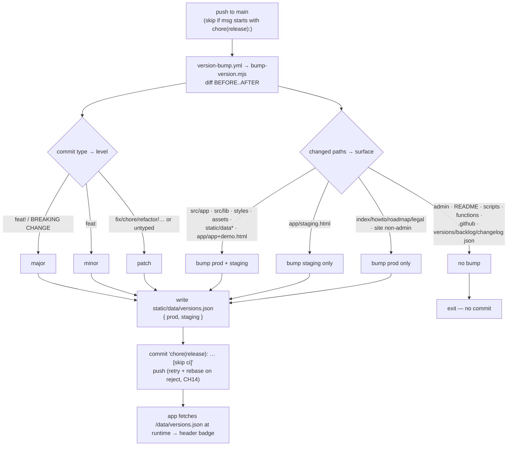

# Versioning & two-track promotion (CH12)

On push to `main`, a dedicated workflow classifies the commit type and the changed paths to bump the
two-track `prod`/`staging` versions automatically — never hand-edited.

**Source of truth:** [`.github/workflows/version-bump.yml`](../../.github/workflows/version-bump.yml) ·
[`scripts/bump-version.mjs`](../../scripts/bump-version.mjs) ·
[`static/data/versions.json`](../../static/data/versions.json) ·
[architecture.md](../architecture.md#versioning--releases-ch12).

## Notes

- **Two orthogonal axes.** The *level* (major/minor/patch) comes from the conventional-commit type;
  the *surface* (prod/staging/both/none) comes from which paths changed. A `feat:` touching
  `src/app/` bumps **both** tracks by a minor; a `chore:` touching only `scripts/` bumps nothing.
- **The workflow ignores its own release commits** (`chore(release): … [skip ci]`) to avoid a loop,
  and serializes via a concurrency group with retry+rebase so racing merges don't clobber each other
  (CH14).
- **Never hand-edit `versions.json`** — CI owns it. Since A33 the version is read from
  `/data/versions.json` at runtime (no badge baked into markup), so the bump writes only that file.
- When `prod` bumps, add a curated [`data/changelog.json`](../../static/data/changelog.json) entry
  (the "Blotterlog") — that file is hand-maintained, not generated from commits.
